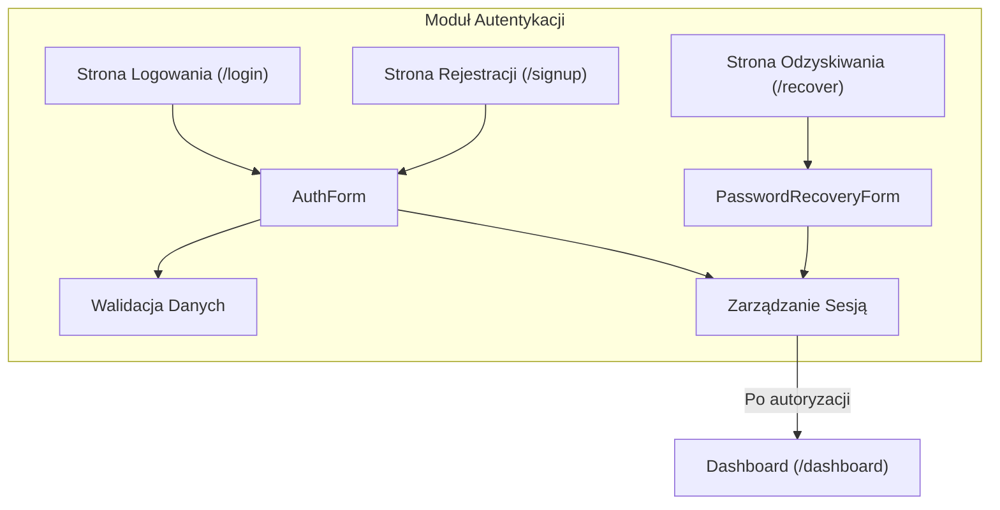

```mermaid
flowchart TD
    subgraph "Moduł Autentykacji"
      loginPage["Strona Logowania (/login)"]
      signupPage["Strona Rejestracji (/signup)"]
      recoverPage["Strona Odzyskiwania (/recover)"]
      
      authForm["AuthForm"]
      passwordRecoveryForm["PasswordRecoveryForm"]
      
      validation["Walidacja Danych"]
      sessionManagement["Zarządzanie Sesją"]
    end

    loginPage --> authForm
    signupPage --> authForm
    recoverPage --> passwordRecoveryForm

    authForm --> validation
    authForm --> sessionManagement
    passwordRecoveryForm --> sessionManagement

    sessionManagement -- "Po autoryzacji" --> dashboard["Dashboard (/dashboard)"]
```